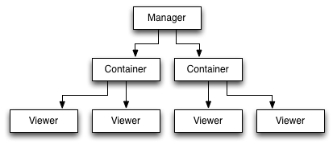
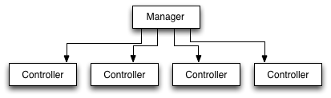

Overview of the API
===================

This document gives a conceptual overview of how Pyglet-gui works.

Pyglet-gui uses :class:`Viewers <pyglet_gui.core.Viewer>` for static appearance
and :class:`Controllers <pyglet_gui.core.Controller>` for dynamic events.
For instance, a button is a mixing of a Viewer (for draw) with a Controller (for user actions).

Viewers and drawing
^^^^^^^^^^^^^^^^^^^^^

In Pyglet-gui, the viewers are organized in a tree: every viewer has a
parent :class:`~pyglet_gui.containers.Container` (a subclass of Viewer with children).
The root of the tree is a :class:`~pyglet_gui.manager.Manager`, a special
container without parent that defines a GUI within a pyglet window.

This structure is essentially used to draw elements. Pyglet-gui provides two orthogonal ways
to draw, the top-down and bottom-up:

Top-down is a recursion in the tree used when a container wants
to draw itself (e.g. in the initialization of the :class:`~pyglet_gui.manager.Manager`).

The container :meth:`loads <pyglet_gui.containers.Container.load>` the children,
which is propagated to other container's children.
After loading, it computes its size by
:meth:`computing the size <pyglet_gui.core.Viewer.compute_size>` of each child.
Finally, it sets its position and :meth:`sets the positions <pyglet_gui.core.Viewer.set_position>` the children.

The bottom-up is a recursion in the tree used when a single Viewer wants to be re-drawn, e.g.
when a mouse press causes a change on the viewer's appearance.

First, it :meth:`~pyglet_gui.core.Viewer.reload` the
graphics with the new appearance;
second, it re-computes its size (:meth:`~pyglet_gui.core.Viewer.reset_size`) to update its size.
If its size changed during this update, it :meth:`~pyglet_gui.core.Viewer.reset_size` the parent container.
This is propagated up in the tree until it reaches the Manager, or until an update doesn't change the container's size.

This means that when a viewer changes its appearance, most of the times the manager is
not re-laid out because the change didn't changed the GUI's size.

Graphical elements
-------------------

A viewer can have different graphical elements (e.g. textures, text).
Pyglet-gui has a :doc:`graphics API <theme_api>` for handling those and
abstracts the idea of images and textures: it uses a high-level interface
on which you build a :class:`pyglet_gui.theme.Theme` loaded from a JSON file or dictionary with file paths and
other data, and viewers select the part they need from the theme using :meth:`~pyglet_gui.core.Viewer.get_path`.

Conceptually, Pyglet-gui theme API follows the factory pattern: the :class:`pyglet_gui.theme.Theme` is a collection
of class factories instantiated when the theme is loaded,
and each template has a method to generate the actual vertex list and textures to load in the drawing batch.

Graphics generation is called in :meth:`pyglet_gui.core.Viewer.load_graphics`, which is called in
:meth:`~pyglet_gui.core.Viewer.load`.

Controllers
^^^^^^^^^^^^^^

The other special feature of the :class:`~pyglet_gui.manager.Manager` is that it handles Pyglet events in the window
and calls the :class:`Controllers <pyglet_gui.core.Controller>` methods.
However, while viewers are organized in a tree, the controllers are organized in a simple list:
each controller registers itself in the manager and the manager has access to all of them.

The user behaviour in the GUI is handled by the manager,
that attaches itself to the Pyglet window as an event handler. Pyglet-gui does not use the Pyglet event API.

Examples
^^^^^^^^^^^^

In the directory "examples" you can find simple examples of how to instantiate GUIs and how to extend the existing
elements.

In the source code you can find more examples: all Pyglet-gui
user interfaces are subclasses of :class:`~pyglet_gui.core.Controller`, :class:`~pyglet_gui.core.Viewer`, or
are a mixin of both that implement the custom methods

* :meth:`~pyglet_gui.core.Viewer.get_path`
* :meth:`~pyglet_gui.core.Viewer.load_graphics`
* :meth:`~pyglet_gui.core.Viewer.unload_graphics`
* :meth:`~pyglet_gui.core.Viewer.layout`
* :meth:`~pyglet_gui.core.Viewer.compute_size`

to obtain different appearance and functionality.

Extending functionality
^^^^^^^^^^^^^^^^^^^^^^^^

Pyglet-gui already has some end-user interfaces such as sliders and buttons, but they were designed to be extendable
to your needs:

To extend a :class:`~pyglet_gui.core.Viewer` (or a subclass of), you should worry about

1. :meth:`~pyglet_gui.core.Viewer.get_path`

    Used to select the path on the theme for its graphics.

2. :meth:`~pyglet_gui.core.Viewer.load_graphics`, :meth:`~pyglet_gui.core.Viewer.unload_graphics`

    Used to load and unload graphical elements from the theme.

3. :meth:`~pyglet_gui.core.Viewer.layout`

    Used to layout the graphics in the correct place.

4. :meth:`~pyglet_gui.core.Viewer.compute_size`

    Used to compute the size of the Viewer when all graphics are already loaded.

To extend a :class:`~pyglet_gui.containers.Container` (or a subclass of), you should worry about

1. :meth:`~pyglet_gui.core.Viewer.load_content`, :meth:`~pyglet_gui.core.Viewer.unload_content`

    Used to load and unload children Viewers on the container.

To extend a :class:`~pyglet_gui.core.Controller` (or a subclass of), you should worry about

1. on_* (e.g. on_press(...))

    They are used to be called from the Manager, e.g. when it handles an event in the window.

Existing user interfaces
^^^^^^^^^^^^^^^^^^^^^^^^

Viewers:
    * Graphics: a viewer with a graphic element from the theme.
    * Spacer: an empty viewer for filling space in containers.
    * Label: a viewer that holds text.
    * Document: a viewer that holds Pyglet documents (optionally with a scrollbar).

Controllers:
    * TwoStateController: a controller with two states.
    * ContinuousStateController: a controller with a float value state.

Containers:
    * Vertical: widgets inside are arranged vertically.
    * Horizontal: widgets inside are arranged horizontally.
    * Grid: widgets inside are arranged in a grid (you provide a matrix of them).
    * Frame: a wrapper that adds a graphical frame around a viewer.
    * Scrollable: a wrapper with scrollable content.

End-user controllers:
    * Button: a On/Off button with a label and graphics placed on top off each other.
    * Checkbox: a Button where the label is placed next to the graphics (and graphics is a checkbox like button).
    * OneTimeButton: a Button which turns off when is released.
    * Slider: a ContinuousStateController with continuous or discrete states and 3 graphic elements: a bar, a knob and markers.
    * HorizontalSlider: an implementation of an Horizontal Slider.
    * TextInput: a box for writing text.
