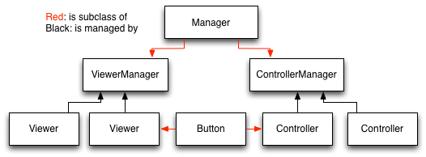

Overview of the API
===================

This document gives an overview of how Pyglet-gui works and what you can do with it.

Pyglet-gui uses :class:`Viewers <pyglet_gui.core.Viewer>` for defining appearance
and :class:`Controllers <pyglet_gui.core.Controller>` for defining behaviour.
For instance, a :class:`Button <pyglet_gui.buttons.Button>` is a subclass of a
Viewer (for draw) and of a Controller (for behaviour).

    A :class:`~pyglet_gui.manager.Manager` defines a GUI in a Pyglet-gui,
    managing :class:`Controllers <pyglet_gui.core.Controller>` and :class:`Viewers <pyglet_gui.core.Viewer>`.

Viewers
^^^^^^^^^^^

.. _`composite pattern`: http://en.wikipedia.org/wiki/Composite_pattern

A Viewer is characterized by a rectangular bounding box that implements abstract methods
to draw :class:`Graphical Elements <pyglet_gui.theme.elements.GraphicalElement>` such as textures, inside it.

In Pyglet-gui, a GUI organizes viewers in a tree: every viewer has a
parent :class:`~pyglet_gui.containers.Container` (a subclass of Viewer with children viewers)
and the root of the tree is a :class:`~pyglet_gui.manager.ViewerManager`, a special
container without parent. This is small variation of the `composite pattern`_.

.. image:: tree.png
    :scale: 100%

This structure is essentially used to minimize the number of operations in the drawing Batch;
Pyglet-gui provides two orthogonal ways to operate on the batch: the top-down and bottom-up:

* Top-down: when a container wants to reload itself in the batch (e.g. in the initialization of the :class:`~pyglet_gui.manager.Manager`).

* Bottom-up: when a single :class:`~pyglet_gui.core.Viewer` wants to reload itself (e.g. when a :class:`Controller <pyglet_gui.core.Controller>` changed a viewer's state).

Pyglet-gui abstracts most of these concepts by a simple interface. The procedure can be decomposed in three steps,
as exemplified in :class:`Button <pyglet_gui.buttons.Button>` source code::

     def change_state(self):
        self._is_pressed = not self._is_pressed
        self.reload()
        self.reset_size()

1. the state of the Viewer changes, and that requires a new appearance;
2. :meth:`~pyglet_gui.core.Viewer.reload` the graphics of the Viewer;
3. :meth:`~pyglet_gui.core.Viewer.reset_size` reset size of the viewer bounding box.

If the Viewer changed size when it became pressed, the method :meth:`~pyglet_gui.core.Viewer.reset_size`
is propagated to the parent container and in the tree up to the container that didn't changed size,
which means that a relayout of the GUI is only made to a certain level in the tree, minimizing
Batch operations. The complete references of this API can be found in :class:`Viewer <pyglet_gui.core.Viewer>`.

Theme and Graphics
^^^^^^^^^^^^^^^^^^^^^

Pyglet-gui has a graphics API for handling vertex lists and vertex attributes:
The developer defines a :class:`~pyglet_gui.theme.theme.Theme` from a dictionary, and viewers select
the part of the theme they need using a path computed from the viewer's current state,
:meth:`~pyglet_gui.core.Viewer.get_path`.

This :class:`~pyglet_gui.theme.theme.Theme` is constructed out of a nested dictionary
by having :class:`Parsers <pyglet_gui.theme.parsers.Parser>`
interpreting the dictionary's content and populating the Theme with
:class:`Templates <pyglet_gui.theme.templates.Template>`.

These templates are able to generate :class:`Graphical Elements <pyglet_gui.theme.elements.GraphicalElement>`
that are used by :class:`Viewers <pyglet_gui.core.Viewer>` to compose their appearance.

Controllers
^^^^^^^^^^^^^^

A Controller represents something that can have behavior, such as something triggered by Pyglet events.

Pyglet-gui uses a :class:`~pyglet_gui.manager.ControllerManager` for handling all window events in the GUI,
and the manager uses these events to call the correct :class:`Controllers' <pyglet_gui.core.Controller>` handlers.

.. image:: controllers.png
    :scale: 100%

    While viewers are organized in a tree, the controllers are organized in a simple list:
    each controller registers itself in the manager and the manager has access to all of them.

A handler in a controller is just a method "on_*": the ControllerManager only handles specific Pyglet events 
and uses :py:meth:`hasattr` to check which controllers receive those events.

Examples
^^^^^^^^^^^^

In the directory "examples" you can find examples of how to instantiate GUIs and how to use the Pyglet-gui
to create elements with custom functionality.

In fact, all Pyglet-gui user interfaces are examples, since they are just subclasses of
:class:`~pyglet_gui.core.Controller`, :class:`~pyglet_gui.core.Viewer`,
or both, that implement custom methods:

* :meth:`~pyglet_gui.core.Viewer.get_path`: used to select the path on the :class:`~pyglet_gui.theme.theme.Theme`;
* :meth:`~pyglet_gui.core.Viewer.load_graphics` and :meth:`~pyglet_gui.core.Viewer.unload_graphics`: used to load and unload :class:`Graphical Elements <pyglet_gui.theme.elements.GraphicalElement>`;
* :meth:`~pyglet_gui.core.Viewer.layout`: used to position the :class:`Graphical Elements <pyglet_gui.theme.elements.GraphicalElement>` in the correct place;
* :meth:`~pyglet_gui.core.Viewer.compute_size`: used to compute the size of the Viewer from the graphics it contains;
* `on_*`: used to handle events.

Existing user interfaces
^^^^^^^^^^^^^^^^^^^^^^^^

Below is a list of the existing elements in Pyglet-gui. Elements that
are not links are not documented yet and most probably are not yet covered by a Test Case.

Viewers:
    * Graphics: a viewer with a graphic element from the theme.
    * Spacer: an empty viewer for filling space in containers.
    * Label: a viewer that holds text.
    * Document: a viewer that holds Pyglet documents (optionally with a scrollbar).

Controllers:
    * :class:`~pyglet_gui.controllers.TwoStateController`: a controller with two states.
    * :class:`~pyglet_gui.controllers.ContinuousStateController`: a controller with a float value state.
    * Slider: a :class:`~pyglet_gui.controllers.ContinuousStateController` with continuous or discrete states and 3 graphic elements: a bar, a knob and markers.

Containers:
    * Vertical: widgets inside are arranged vertically.
    * Horizontal: widgets inside are arranged horizontally.
    * Grid: widgets inside are arranged in a grid (you provide a matrix of them).
    * Frame: a wrapper that adds a graphical frame around a viewer.
    * Scrollable: a wrapper with scrollable content.

End-user controllers:
    * :class:`~pyglet_gui.buttons.Button`: a On/Off button with a label and graphics placed on top off each other.
    * OneTimeButton: a Button which turns off when is released.
    * Checkbox: a Button where the label is placed next to the graphics (and graphics is a checkbox-like button).
    * HorizontalSlider: an concrete implementation of a Slider, in horizontal position.
    * TextInput: a box for writing text.
